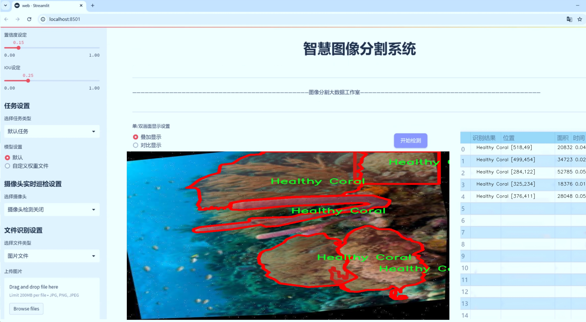
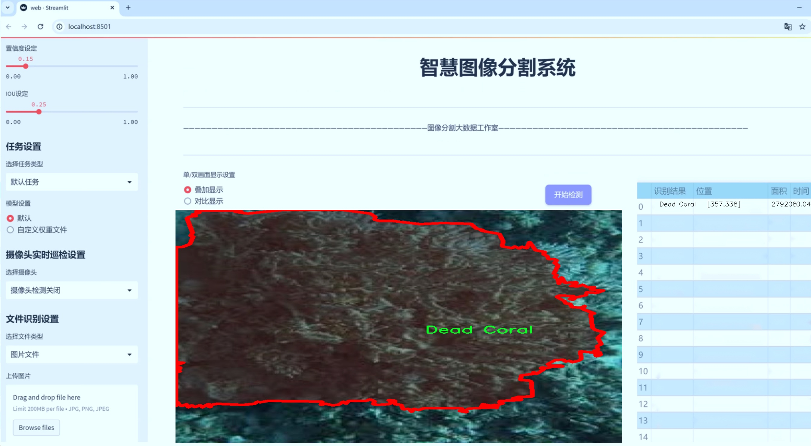
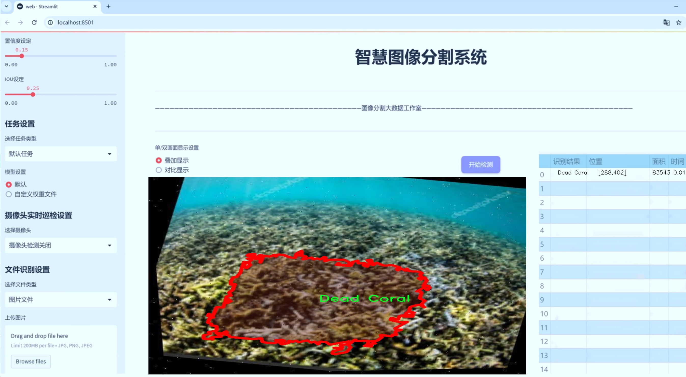
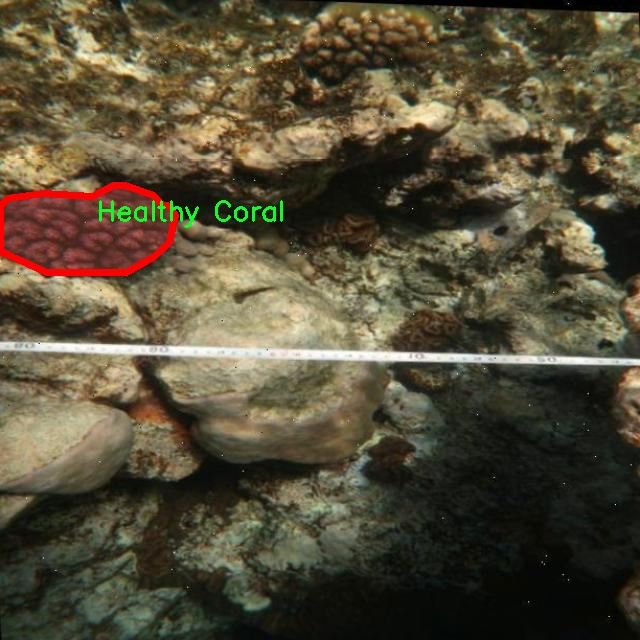
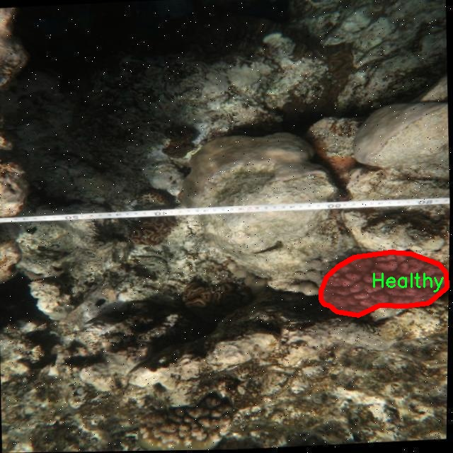
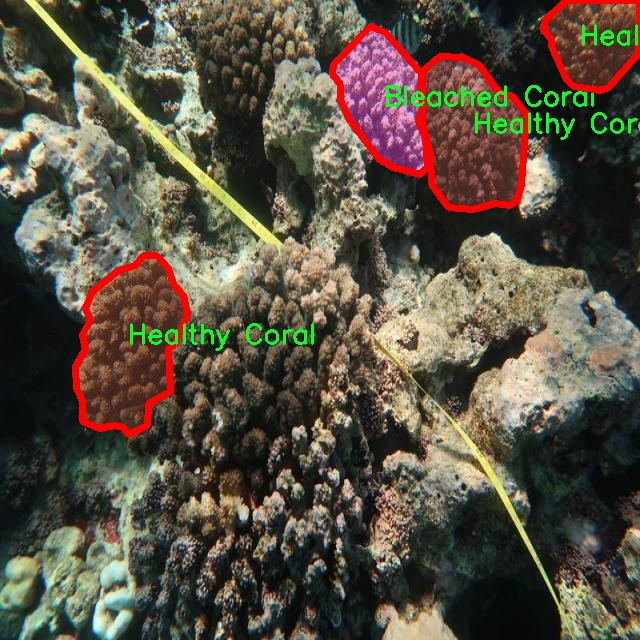
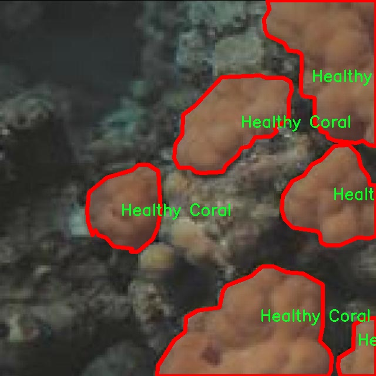
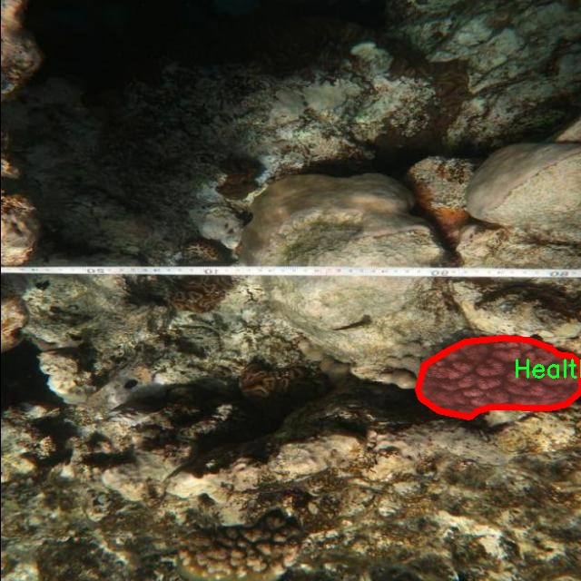

# 珊瑚健康状态分割系统： yolov8-seg-C2f-DLKA

### 1.研究背景与意义

[参考博客](https://gitee.com/YOLOv8_YOLOv11_Segmentation_Studio/projects)

[博客来源](https://kdocs.cn/l/cszuIiCKVNis)

研究背景与意义

随着全球气候变化和人类活动的加剧，珊瑚礁生态系统正面临前所未有的威胁。珊瑚作为海洋生态系统的重要组成部分，不仅为众多海洋生物提供栖息地，还在维持海洋生物多样性和保护海岸线方面发挥着不可替代的作用。然而，珊瑚的健康状况受到温度升高、酸化、污染以及过度捕捞等多重因素的影响，导致珊瑚白化、死亡和生态系统的崩溃。因此，及时、准确地监测和评估珊瑚的健康状态，对于保护和恢复珊瑚礁生态系统具有重要的现实意义。

在这一背景下，计算机视觉技术的快速发展为珊瑚健康状态的监测提供了新的可能性。尤其是基于深度学习的目标检测与分割技术，能够高效地处理和分析大规模的图像数据，从而实现对珊瑚健康状态的自动化评估。YOLO（You Only Look Once）系列模型因其高效性和准确性，已成为目标检测领域的热门选择。YOLOv8作为该系列的最新版本，进一步提升了模型的性能，具备了更强的特征提取能力和实时处理能力。然而，现有的YOLOv8模型在处理特定领域（如珊瑚健康状态监测）时，仍然存在一定的局限性，主要体现在对细微特征的识别和分类精度上。

本研究旨在基于改进的YOLOv8模型，构建一个高效的珊瑚健康状态分割系统。我们将利用包含2400幅图像的数据集，该数据集涵盖了三类珊瑚状态：漂白珊瑚、死亡珊瑚和健康珊瑚。这一数据集的构建不仅为模型的训练提供了丰富的样本，也为后续的模型评估和优化奠定了基础。通过对不同状态珊瑚的精确分割与分类，我们希望能够实现对珊瑚健康状况的实时监测，为海洋生态保护提供科学依据。

此外，改进YOLOv8模型的应用不仅限于珊瑚健康状态的监测，还可以扩展到其他海洋生物的监测与保护。通过对模型的进一步优化和推广，能够为海洋生态保护提供更加全面和高效的技术支持。同时，本研究也将为相关领域的研究者提供新的思路和方法，推动计算机视觉技术在生态环境监测中的应用。

综上所述，基于改进YOLOv8的珊瑚健康状态分割系统的研究，不仅具有重要的理论价值，还具备广泛的实际应用前景。通过对珊瑚健康状态的准确评估，我们能够为珊瑚礁的保护与恢复提供科学依据，进而促进海洋生态系统的可持续发展。这一研究不仅是对现有技术的创新应用，更是对全球海洋生态保护事业的积极贡献。

### 2.图片演示







注意：本项目提供完整的训练源码数据集和训练教程,由于此博客编辑较早,暂不提供权重文件（best.pt）,需要按照6.训练教程进行训练后实现上图效果。

### 3.视频演示

[3.1 视频演示](https://www.bilibili.com/video/BV1Lwz6YGEPc/)

### 4.数据集信息

##### 4.1 数据集类别数＆类别名

nc: 3
names: ['Bleached Coral', 'Dead Coral', 'Healthy Coral']


##### 4.2 数据集信息简介

数据集信息展示

在本研究中，我们使用了名为“marjan-segmentation”的数据集，旨在改进YOLOv8-seg模型，以实现对珊瑚健康状态的精确分割。珊瑚礁生态系统是海洋生物多样性的重要组成部分，而珊瑚的健康状况直接影响到整个生态系统的稳定性。因此，开发一种高效的自动化分割系统，能够准确识别和分类不同健康状态的珊瑚，对于海洋保护和生态监测具有重要意义。

“marjan-segmentation”数据集包含三种主要类别，分别是“Bleached Coral”（漂白珊瑚）、“Dead Coral”（死亡珊瑚）和“Healthy Coral”（健康珊瑚）。这些类别的划分不仅反映了珊瑚的生理状态，也揭示了环境变化对珊瑚礁生态系统的影响。漂白珊瑚通常是由于温度升高、污染或其他环境压力导致的生理应激反应，若不加以保护，可能会转变为死亡珊瑚。死亡珊瑚则代表了生态系统的退化，失去了生物栖息地和食物来源，最终影响到整个海洋生态链。而健康珊瑚则是生态系统的基石，能够支持丰富的海洋生物多样性。

该数据集的构建过程经过精心设计，确保了样本的多样性和代表性。数据集中包含了大量的高分辨率图像，涵盖了不同的地理位置和环境条件，以便模型能够学习到各种情况下珊瑚的特征。这些图像经过标注，明确指出了每种类别的区域，为模型的训练提供了可靠的基础。通过使用这些标注数据，YOLOv8-seg模型能够在训练过程中不断优化其特征提取和分类能力，从而提高对珊瑚健康状态的识别精度。

在训练过程中，我们采用了数据增强技术，以增加模型的鲁棒性和泛化能力。这些技术包括图像旋转、缩放、翻转和颜色调整等，旨在模拟不同的观察条件和环境变化，使模型能够更好地适应实际应用场景。此外，我们还进行了交叉验证，以确保模型在不同数据子集上的表现一致，从而提高其可靠性。

通过对“marjan-segmentation”数据集的深入分析和训练，我们期望能够开发出一种高效的珊瑚健康状态分割系统。这一系统不仅能够实时监测珊瑚礁的健康状况，还能为科学研究和环境保护提供重要的数据支持。未来，我们希望将这一技术应用于更广泛的海洋生态监测项目中，为保护和恢复珊瑚礁生态系统贡献力量。











### 5.项目依赖环境部署教程（零基础手把手教学）

[5.1 环境部署教程链接（零基础手把手教学）](https://www.bilibili.com/video/BV1jG4Ve4E9t/?vd_source=bc9aec86d164b67a7004b996143742dc)


[5.2 安装Python虚拟环境创建和依赖库安装视频教程链接（零基础手把手教学）](https://www.bilibili.com/video/BV1nA4VeYEze/?vd_source=bc9aec86d164b67a7004b996143742dc)

### 6.手把手YOLOV8-seg训练视频教程（零基础手把手教学）

[6.1 手把手YOLOV8-seg训练视频教程（零基础小白有手就能学会）](https://www.bilibili.com/video/BV1cA4VeYETe/?vd_source=bc9aec86d164b67a7004b996143742dc)


按照上面的训练视频教程链接加载项目提供的数据集，运行train.py即可开始训练



     Epoch   gpu_mem       box       obj       cls    labels  img_size
     1/200     0G   0.01576   0.01955  0.007536        22      1280: 100%|██████████| 849/849 [14:42<00:00,  1.04s/it]
               Class     Images     Labels          P          R     mAP@.5 mAP@.5:.95: 100%|██████████| 213/213 [01:14<00:00,  2.87it/s]
                 all       3395      17314      0.994      0.957      0.0957      0.0843

     Epoch   gpu_mem       box       obj       cls    labels  img_size
     2/200     0G   0.01578   0.01923  0.007006        22      1280: 100%|██████████| 849/849 [14:44<00:00,  1.04s/it]
               Class     Images     Labels          P          R     mAP@.5 mAP@.5:.95: 100%|██████████| 213/213 [01:12<00:00,  2.95it/s]
                 all       3395      17314      0.996      0.956      0.0957      0.0845

     Epoch   gpu_mem       box       obj       cls    labels  img_size
     3/200     0G   0.01561    0.0191  0.006895        27      1280: 100%|██████████| 849/849 [10:56<00:00,  1.29it/s]
               Class     Images     Labels          P          R     mAP@.5 mAP@.5:.95: 100%|███████   | 187/213 [00:52<00:00,  4.04it/s]
                 all       3395      17314      0.996      0.957      0.0957      0.0845


### 7.50+种全套YOLOV8-seg创新点加载调参实验视频教程（一键加载写好的改进模型的配置文件）

[7.1 50+种全套YOLOV8-seg创新点加载调参实验视频教程（一键加载写好的改进模型的配置文件）](https://www.bilibili.com/video/BV1Hw4VePEXv/?vd_source=bc9aec86d164b67a7004b996143742dc)

### YOLOV8-seg算法简介

原始YOLOv8-seg算法原理

YOLOv8-seg算法是YOLO系列中的最新进展，专注于目标检测与实例分割的高效结合。该算法不仅继承了YOLOv5的优良特性，还融合了其他先进模型的设计理念，形成了一种全新的、具有高度灵活性和适应性的目标检测框架。其核心思想是通过高效的特征提取和处理机制，实现在复杂场景下的精准目标识别与分割。

首先，YOLOv8-seg在骨干网络的设计上，继续采用跨级结构（Cross Stage Partial, CSP）以增强特征的表达能力。这种结构通过分割特征图并在不同阶段进行处理，能够有效减少信息的冗余，同时保持高效的特征传递。YOLOv8-seg对YOLOv5中的C3模块进行了优化，采用了更轻量的C2f模块。这一改进不仅降低了计算复杂度，还提升了模型的整体性能，使得YOLOv8-seg在处理高分辨率图像时依然能够保持良好的实时性。

在特征融合方面，YOLOv8-seg继续使用特征金字塔网络（PAN-FPN）结构，以增强多尺度特征的融合能力。通过在不同层次间有效地整合特征，YOLOv8-seg能够更好地捕捉到小目标和复杂背景下的细节信息。此外，YOLOv8-seg还引入了空间金字塔池化（SPPF）模块，以进一步提升特征的多样性和表达能力，从而提高目标检测的准确性。

值得注意的是，YOLOv8-seg在损失函数的设计上进行了创新，采用了变焦损失策略。这种策略通过动态调整损失权重，使得模型在训练过程中能够更加关注难以检测的目标，进而提升分类和边界框回归的精度。同时，YOLOv8-seg还引入了数据平均保真度损失和完美交并比损失，以优化边界框的预测。这种多层次的损失计算方式，使得YOLOv8-seg在面对复杂场景时，能够更准确地进行目标定位和分割。

在样本匹配方面，YOLOv8-seg引入了新的匹配策略，以提高模型在不同场景下的适应性。这种策略不仅考虑了目标的空间位置，还综合了目标的特征信息，从而实现了更为精准的目标检测与分割。这一创新使得YOLOv8-seg在处理动态场景或复杂背景时，能够有效降低误检率和漏检率，进一步提升了模型的实用性。

YOLOv8-seg的设计理念还体现在其高效的推理能力上。该算法在CPU和GPU等多种硬件平台上均能高效运行，展现出极强的灵活性和适应性。这一特性使得YOLOv8-seg不仅适用于传统的目标检测任务，还能够广泛应用于实时视频分析、无人驾驶、智能监控等多个领域。

通过对YOLOv8-seg的深入分析，可以发现其在目标检测与实例分割领域的巨大潜力。该算法的设计不仅关注模型的准确性和速度，还强调了模型的易用性和可扩展性。这一特点使得YOLOv8-seg能够快速适应不同的应用场景，为目标检测技术的发展提供了新的思路。

综上所述，YOLOv8-seg算法通过一系列创新的设计和优化，成功实现了高效的目标检测与实例分割。其在骨干网络、特征融合、损失函数及样本匹配等方面的改进，使得YOLOv8-seg在面对复杂场景时，依然能够保持高精度和高速度的优势。这一算法的推出，无疑为计算机视觉领域带来了新的机遇与挑战，推动了目标检测技术的进一步发展。


### 9.系统功能展示（检测对象为举例，实际内容以本项目数据集为准）

图9.1.系统支持检测结果表格显示

  图9.2.系统支持置信度和IOU阈值手动调节

  图9.3.系统支持自定义加载权重文件best.pt(需要你通过步骤5中训练获得)

  图9.4.系统支持摄像头实时识别

  图9.5.系统支持图片识别

  图9.6.系统支持视频识别

  图9.7.系统支持识别结果文件自动保存

  图9.8.系统支持Excel导出检测结果数据


### 10.50+种全套YOLOV8-seg创新点原理讲解（非科班也可以轻松写刊发刊，V11版本正在科研待更新）

#### 10.1 由于篇幅限制，每个创新点的具体原理讲解就不一一展开，具体见下列网址中的创新点对应子项目的技术原理博客网址【Blog】：


[10.1 50+种全套YOLOV8-seg创新点原理讲解链接](https://gitee.com/qunmasj/good)

#### 10.2 部分改进模块原理讲解(完整的改进原理见上图和技术博客链接)【如果此小节的图加载失败可以通过CSDN或者Github搜索该博客的标题访问原始博客，原始博客图片显示正常】

### YOLOv8简介
#### YOLOv8是什么？
YOLOv8是Ultralytics公司推出的基于对象检测模型的YOLO最新系列，它能够提供截至目前最先进的对象检测性能。

借助于以前的YOLO模型版本支持技术，YOLOv8模型运行得更快、更准确，同时为执行任务的训练模型提供了统一的框架，这包括：

目标检测
实例分割
图像分类
在撰写本文时，Ultralytics的YOLOv8存储库中其实还有很多功能有待添加，这包括训练模型的整套导出功能等。此外，Ultralytics将计划在Arxiv上发布一篇相关的论文，将对YOLOv8与其他最先进的视觉模型进行比较。

#### YOLOv8的新功能
Ultralytics为YOLO模型发布了一个全新的存储库（https://github.com/ultralytics/ultralytics）。该存储库被构建为用于训练对象检测、实例分割和图像分类模型的统一框架。

以下列举的是这个新版本的一些关键功能：

用户友好的API（命令行+Python）。
更快、更准确。
支持：
目标检测，
实例分割和
图像分类。
可扩展到所有以前的版本。
新的骨干网络。
新的Anchor-Free head对象检测算法。
新的损失函数。
此外，YOLOv8也非常高效和灵活，它可以支持多种导出格式，而且该模型可以在CPU和GPU上运行。

#### YOLOv8中提供的子模型


YOLOv8模型的每个类别中共有五个模型，以便共同完成检测、分割和分类任务。其中，YOLOv8 Nano是最快和最小的模型，而YOLOv8Extra Large（YOLOv8x）是其中最准确但最慢的模型。

YOLOv8这次发行中共附带了以下预训练模型：

在图像分辨率为640的COCO检测数据集上训练的对象检测检查点。
在图像分辨率为640的COCO分割数据集上训练的实例分割检查点。
在图像分辨率为224的ImageNet数据集上预处理的图像分类模型。
### 高效网络架构 CloAtt简介
众所周知，自从 ViTs 提出后，Transformer 基本横扫各大 CV 主流任务，包括视觉识别、目标检测和语义分割等。然而，一个比较棘手的问题就是这个架构参数量和计算量太大，所以一直被广受诟病。因此，后续有不少工作都是朝着这个方向去改进，例如 Swin-Transformer 在局部非重叠窗口中进行注意力计算，而 PVT 中则是使用平均池化来合并 token 以进一步压缩耗时。然而，这些 ViTs 由于其参数量太大以及高 FLOPs 并不适合部署到移动设备。如果我们直接缩小到适合移动设备的尺寸时，它们的性能又会显著降低。


#### MobileViT
因此，出现了不少工作聚焦于探索轻量级的视觉变换器，使 ViTs 适用于移动设备，CVHub 此前也介绍过不少的工作，大家有兴趣可以翻阅历史文章读读。例如，苹果团队提出的 MobileViT 研究了如何将 CNN 与 Transformer 相结合，而另一个工作 MobileFormer 则将轻量级的 MobileNet 与 Transformer 进行融合。此外，最新提出的 EdgeViT 提出了一个局部-全局-局部模块来聚合信息。以上工作的目标都是设计具有高性能、较少参数和低 FLOPs 的移动端友好型模型。


#### EdgeViT
然而，作者从频域编码的角度认为，在现有的轻量级模型中，大多数方法只关注设计稀疏注意力，以有效地处理低频全局信息，而使用相对简单的方法处理高频局部信息。具体而言，大多数模型如 EdgeViT 和 MobileViT，只是简单使用原始卷积提取局部表示，这些方法仅使用卷积中的全局共享权重处理高频本地信息。其他方法，如 LVT ，则是首先将标记展开到窗口中，然后使用窗口内的注意力获得高频信息。这些方法仅使用特定于每个 Token 的上下文感知权重进行局部感知。


#### LVT
虽然上述轻量级模型在多个数据集上取得了良好的结果，但没有一种方法尝试设计更有效的方法，即利用共享和上下文感知权重的优势来处理高频局部信息。基于共享权重的方法，如传统的卷积神经网络，具有平移等变性的特征。与它们不同，基于上下文感知权重的方法，如 LVT 和 NAT，具有可以随输入内容变化的权重。这两种类型的权重在局部感知中都有自己的优势。
#### NAT


受该博客的启发，本文设计了一种轻量级视觉变换器——CloAtt，其利用了上下文感知的局部增强。特别地，CloAtt 采用了双分支设计结构。
#### 局部分支
在局部分支中，本文引入了一个精心设计的 AttnConv，一种简单而有效的卷积操作符，它采用了注意力机制的风格。所提出的 AttnConv 有效地融合了共享权重和上下文感知权重，以聚合高频的局部信息。具体地，AttnConv 首先使用深度卷积（DWconv）提取局部表示，其中 DWconv 具有共享权重。然后，其使用上下文感知权重来增强局部特征。与 Non-Local 等生成上下文感知权重的方法不同，AttnConv 使用门控机制生成上下文感知权重，引入了比常用的注意力机制更强的非线性。此外，AttnConv 将卷积算子应用于 Query 和 Key 以聚合局部信息，然后计算 Q 和 K 的哈达玛积，并对结果进行一系列线性或非线性变换，生成范围在 [-1,1] 之间的上下文感知权重。值得注意的是，AttnConv 继承了卷积的平移等变性，因为它的所有操作都基于卷积。
#### 全局分支
在全局分支中则使用了传统的注意力机制，但对 K 和 V 进行了下采样以减少计算量，从而捕捉低频全局信息。最后，CloFormer 通过简单的方法将局部分支和全局分支的输出进行融合，从而使模型能够同时捕捉高频和低频信息。总的来说，CloFormer 的设计能够同时发挥共享权重和上下文感知权重的优势，提高其局部感知的能力，使其在图像分类、物体检测和语义分割等多个视觉任务上均取得了优异的性能。
如上图2所示，CloFormer 共包含一个卷积主干和四个 stage，每个 stage you Clo 模块 和 ConvFFN 组合而成的模块堆叠而成 。具体得，首先将输入图像通过卷积主干传递，以获取 token 表示。该主干由四个卷积组成，每个卷积的步长依次为2、2、1和1。接下来，tokens 经历四个 Clo 块和 ConvFFN 阶段，以提取分层特征。最后，再利用全局平均池化和全连接层生成预测结果。可以看出，整个架构非常简洁，支持即插即用！


#### ConvFFN
为了将局部信息融入 FFN 过程中，本文采用 ConvFFN 替换了常用的 FFN。ConvFFN 和常用的 FFN 的主要区别在于，ConvFFN 在 GELU 激活函数之后使用了深度卷积（DWconv），从而使 ConvFFN 能够聚合局部信息。由于DWconv 的存在，可以直接在 ConvFFN 中进行下采样而不需要引入 PatchMerge 模块。CloFormer 使用了两种ConvFFN。第一种是在阶段内的 ConvFFN，它直接利用跳跃连接。另一种是连接两个阶段的 ConvFFN，主要用于下采样操作。
#### Clo block
CloFormer 中的 Clo块 是非常关键的组件。每个 Clo 块由一个局部分支和一个全局分支组成。在全局分支中，我们首先下采样 K 和 V，然后对 Q、K 和 V 进行标准的 attention 操作，以提取低频全局信息。
虽然全局分支的设计能够有效减少注意力机制所需的浮点运算次数，并且能够获得全局的感受野。然而，它在处理高频局部信息方面的能力不足。为了解决这个问题，CloFormer 引入了局部分支，并使用 AttnConv 对高频局部信息进行处理。AttnConv 可以融合共享权重和上下文感知权重，能够更好地处理高频局部信息。因此，CloFormer 结合了全局和局部的优势来提高图像分类性能。下面我们重点讲下 AttnConv 。
#### AttnConv
AttnConv 是一个关键模块，使得所提模型能够获得高性能。它结合了一些标准的 attention 操作。具体而言，在AttnConv 中，我们首先进行线性变换以获得 Q、K和V。在进行线性变换之后，我们再对 V 进行共享权重的局部特征聚合。然后，基于处理后的 V 和 Q ，K 进行上下文感知的局部增强。具体流程可对照流程图理解，我们可以将其拆解成三个步骤。
#### Local Feature Aggregation
为了简单起见，本文直接使用一个简单的深度卷积（DWconv）来对 V 进行局部信息聚合。
#### Context-aware Local Enhancement
在将具有共享权重的局部信息整合到 V 中后，我们结合 Q 和 K 生成上下文感知权重。值得注意的是，我们使用了与局部自注意力不同的方法，该方法更加简洁。具体而言，我们首先使用两个 DWconv 对 Q 和 K 分别进行局部信息聚合。然后，我们计算 Q 和 K 的 Hadamard 乘积，并对结果进行一系列转换，以获取在 -1 到 1 之间的上下文感知权重。最后，我们使用生成的权重来增强局部特征。
#### Fusion with Global Branch
在整个 CloFormer 中，我们使用一种简单直接的方法来将局部分支和全局分支的输出进行融合。具体而言，本文是通过将这两个输出在通道维度上进行直接拼接，然后再通过一个 FC 层聚合这些特征并结合残差输出。
最后，上图展示了三种不同的方法。相比于传统卷积，AttnConv 中的上下文感知权重使得模型能够更好地适应输入内容。相比于局部自注意力机制，引入共享权重使得模型能够更好地处理高频信息，从而提高性能。此外，生成上下文感知权重的方法引入了更强的非线性性，也提高了性能。需要注意的是，AttnConv 中的所有操作都基于卷积，保持了卷积的平移等变性特性。


### 11.项目核心源码讲解（再也不用担心看不懂代码逻辑）

#### 11.1 ultralytics\nn\modules\transformer.py

以下是经过简化和注释的核心代码，主要保留了TransformerEncoderLayer、AIFI、TransformerLayer、TransformerBlock、MLPBlock、MLP、LayerNorm2d、MSDeformAttn、DeformableTransformerDecoderLayer和DeformableTransformerDecoder类的核心部分，并添加了详细的中文注释。

```python
import torch
import torch.nn as nn
import torch.nn.functional as F

class TransformerEncoderLayer(nn.Module):
    """定义一个Transformer编码器层。"""

    def __init__(self, c1, cm=2048, num_heads=8, dropout=0.0, act=nn.GELU(), normalize_before=False):
        """初始化TransformerEncoderLayer，设置参数。"""
        super().__init__()
        self.ma = nn.MultiheadAttention(c1, num_heads, dropout=dropout, batch_first=True)  # 多头自注意力机制
        self.fc1 = nn.Linear(c1, cm)  # 前馈网络的第一层
        self.fc2 = nn.Linear(cm, c1)  # 前馈网络的第二层
        self.norm1 = nn.LayerNorm(c1)  # 第一层归一化
        self.norm2 = nn.LayerNorm(c1)  # 第二层归一化
        self.dropout = nn.Dropout(dropout)  # dropout层
        self.act = act  # 激活函数
        self.normalize_before = normalize_before  # 是否在前向传播前进行归一化

    def forward(self, src, src_mask=None, src_key_padding_mask=None, pos=None):
        """前向传播，通过编码器模块传递输入。"""
        if self.normalize_before:
            return self.forward_pre(src, src_mask, src_key_padding_mask, pos)
        return self.forward_post(src, src_mask, src_key_padding_mask, pos)

    def forward_post(self, src, src_mask=None, src_key_padding_mask=None, pos=None):
        """后归一化的前向传播。"""
        q = k = src + (pos if pos is not None else 0)  # 加入位置编码
        src2 = self.ma(q, k, value=src, attn_mask=src_mask, key_padding_mask=src_key_padding_mask)[0]
        src = src + self.dropout(src2)  # 残差连接
        src = self.norm1(src)  # 归一化
        src2 = self.fc2(self.dropout(self.act(self.fc1(src))))  # 前馈网络
        return self.norm2(src + self.dropout(src2))  # 残差连接和归一化

class AIFI(TransformerEncoderLayer):
    """定义AIFI变换层。"""

    def forward(self, x):
        """AIFI变换层的前向传播。"""
        c, h, w = x.shape[1:]  # 获取通道、高度和宽度
        pos_embed = self.build_2d_sincos_position_embedding(w, h, c)  # 构建2D位置编码
        x = super().forward(x.flatten(2).permute(0, 2, 1), pos=pos_embed.to(device=x.device, dtype=x.dtype))
        return x.permute(0, 2, 1).view([-1, c, h, w]).contiguous()  # 恢复原始形状

    @staticmethod
    def build_2d_sincos_position_embedding(w, h, embed_dim=256):
        """构建2D正弦余弦位置编码。"""
        grid_w = torch.arange(int(w), dtype=torch.float32)
        grid_h = torch.arange(int(h), dtype=torch.float32)
        grid_w, grid_h = torch.meshgrid(grid_w, grid_h, indexing='ij')
        pos_dim = embed_dim // 4
        omega = torch.arange(pos_dim, dtype=torch.float32) / pos_dim
        out_w = grid_w.flatten()[..., None] @ (1. / (10000 ** omega[None]))
        out_h = grid_h.flatten()[..., None] @ (1. / (10000 ** omega[None]))
        return torch.cat([torch.sin(out_w), torch.cos(out_w), torch.sin(out_h), torch.cos(out_h)], 1)[None]

class TransformerLayer(nn.Module):
    """Transformer层，使用线性变换和多头注意力机制。"""

    def __init__(self, c, num_heads):
        """初始化自注意力机制。"""
        super().__init__()
        self.q = nn.Linear(c, c, bias=False)  # 查询线性变换
        self.k = nn.Linear(c, c, bias=False)  # 键线性变换
        self.v = nn.Linear(c, c, bias=False)  # 值线性变换
        self.ma = nn.MultiheadAttention(embed_dim=c, num_heads=num_heads)  # 多头注意力机制
        self.fc1 = nn.Linear(c, c, bias=False)  # 前馈网络的第一层
        self.fc2 = nn.Linear(c, c, bias=False)  # 前馈网络的第二层

    def forward(self, x):
        """应用Transformer块到输入x并返回输出。"""
        x = self.ma(self.q(x), self.k(x), self.v(x))[0] + x  # 自注意力机制
        return self.fc2(self.fc1(x)) + x  # 前馈网络和残差连接

class TransformerBlock(nn.Module):
    """视觉Transformer模块。"""

    def __init__(self, c1, c2, num_heads, num_layers):
        """初始化Transformer模块。"""
        super().__init__()
        self.conv = nn.Conv2d(c1, c2, kernel_size=1) if c1 != c2 else None  # 可选的卷积层
        self.tr = nn.Sequential(*(TransformerLayer(c2, num_heads) for _ in range(num_layers)))  # 多层Transformer层

    def forward(self, x):
        """通过瓶颈模块前向传播输入。"""
        if self.conv is not None:
            x = self.conv(x)  # 如果有卷积层，进行卷积
        b, _, w, h = x.shape
        p = x.flatten(2).permute(2, 0, 1)  # 变换形状
        return self.tr(p).permute(1, 2, 0).reshape(b, -1, w, h)  # 通过Transformer层并恢复形状

class MLPBlock(nn.Module):
    """实现多层感知机的单个块。"""

    def __init__(self, embedding_dim, mlp_dim, act=nn.GELU):
        """初始化MLPBlock。"""
        super().__init__()
        self.lin1 = nn.Linear(embedding_dim, mlp_dim)  # 第一层线性变换
        self.lin2 = nn.Linear(mlp_dim, embedding_dim)  # 第二层线性变换
        self.act = act()  # 激活函数

    def forward(self, x: torch.Tensor) -> torch.Tensor:
        """MLPBlock的前向传播。"""
        return self.lin2(self.act(self.lin1(x)))  # 前向传播

class LayerNorm2d(nn.Module):
    """2D层归一化模块。"""

    def __init__(self, num_channels, eps=1e-6):
        """初始化LayerNorm2d。"""
        super().__init__()
        self.weight = nn.Parameter(torch.ones(num_channels))  # 权重
        self.bias = nn.Parameter(torch.zeros(num_channels))  # 偏置
        self.eps = eps  # 防止除零的常数

    def forward(self, x):
        """执行2D层归一化的前向传播。"""
        u = x.mean(1, keepdim=True)  # 计算均值
        s = (x - u).pow(2).mean(1, keepdim=True)  # 计算方差
        x = (x - u) / torch.sqrt(s + self.eps)  # 归一化
        return self.weight[:, None, None] * x + self.bias[:, None, None]  # 应用权重和偏置

class MSDeformAttn(nn.Module):
    """多尺度可变形注意力模块。"""

    def __init__(self, d_model=256, n_levels=4, n_heads=8, n_points=4):
        """初始化MSDeformAttn。"""
        super().__init__()
        self.sampling_offsets = nn.Linear(d_model, n_heads * n_levels * n_points * 2)  # 采样偏移量
        self.attention_weights = nn.Linear(d_model, n_heads * n_levels * n_points)  # 注意力权重
        self.value_proj = nn.Linear(d_model, d_model)  # 值的线性变换
        self.output_proj = nn.Linear(d_model, d_model)  # 输出的线性变换

    def forward(self, query, refer_bbox, value, value_shapes, value_mask=None):
        """执行多尺度可变形注意力的前向传播。"""
        value = self.value_proj(value)  # 变换值
        sampling_offsets = self.sampling_offsets(query)  # 计算采样偏移量
        attention_weights = self.attention_weights(query)  # 计算注意力权重
        # 计算采样位置和输出
        output = multi_scale_deformable_attn_pytorch(value, value_shapes, sampling_locations, attention_weights)
        return self.output_proj(output)  # 变换输出

class DeformableTransformerDecoderLayer(nn.Module):
    """可变形Transformer解码器层。"""

    def __init__(self, d_model=256, n_heads=8, d_ffn=1024, dropout=0., act=nn.ReLU()):
        """初始化DeformableTransformerDecoderLayer。"""
        super().__init__()
        self.self_attn = nn.MultiheadAttention(d_model, n_heads, dropout=dropout)  # 自注意力
        self.cross_attn = MSDeformAttn(d_model)  # 交叉注意力
        self.linear1 = nn.Linear(d_model, d_ffn)  # 前馈网络的第一层
        self.linear2 = nn.Linear(d_ffn, d_model)  # 前馈网络的第二层

    def forward(self, embed, refer_bbox, feats, shapes, padding_mask=None, attn_mask=None):
        """执行解码器层的前向传播。"""
        tgt = self.self_attn(embed, embed, embed)[0] + embed  # 自注意力
        tgt = self.cross_attn(tgt, refer_bbox.unsqueeze(2), feats, shapes) + tgt  # 交叉注意力
        return self.linear2(F.relu(self.linear1(tgt))) + tgt  # 前馈网络和残差连接

class DeformableTransformerDecoder(nn.Module):
    """可变形Transformer解码器。"""

    def __init__(self, hidden_dim, decoder_layer, num_layers):
        """初始化DeformableTransformerDecoder。"""
        super().__init__()
        self.layers = nn.ModuleList([decoder_layer for _ in range(num_layers)])  # 多层解码器层

    def forward(self, embed, refer_bbox, feats, shapes):
        """执行解码器的前向传播。"""
        output = embed
        for layer in self.layers:
            output = layer(output, refer_bbox, feats, shapes)  # 通过每一层解码器
        return output  # 返回最终输出
```

以上代码保留了核心功能和结构，并添加了详细的中文注释，便于理解每个部分的作用和实现逻辑。

该文件实现了一个用于目标检测的变换器模块，主要包含了变换器编码器层、解码器层及相关组件。首先，文件导入了必要的库，包括PyTorch的神经网络模块和一些实用工具。接下来，定义了多个类，每个类都实现了特定的功能。

`TransformerEncoderLayer`类定义了变换器编码器的单层结构。它使用多头自注意力机制和前馈神经网络来处理输入数据。构造函数中设置了多个参数，如输入通道数、头数、丢弃率等。`forward`方法实现了前向传播，可以选择在前归一化或后归一化模式下进行计算。

`AIFI`类继承自`TransformerEncoderLayer`，实现了一个特定的变换器层。它在前向传播中构建了2D正弦余弦位置嵌入，并将输入张量展平以适应变换器的输入格式。

`TransformerLayer`类实现了一个简单的变换器层，包含自注意力机制和前馈网络。它通过线性变换生成查询、键和值，并应用多头注意力。

`TransformerBlock`类则将多个`TransformerLayer`组合在一起，形成一个完整的变换器模块。它可以选择性地应用卷积层以调整输入的通道数。

`MLPBlock`和`MLP`类实现了多层感知机（MLP），前者是单个MLP块，后者则是多个MLP层的组合，支持指定的输入、隐藏和输出维度。

`LayerNorm2d`类实现了2D层归一化，适用于卷积神经网络中的特征图。它通过计算均值和方差来归一化输入。

`MSDeformAttn`类实现了多尺度可变形注意力机制，允许模型在不同尺度上进行特征提取。它通过计算采样偏移量和注意力权重来实现。

`DeformableTransformerDecoderLayer`类实现了可变形变换器解码器层，结合了自注意力和交叉注意力机制。它的前向传播方法处理输入嵌入、参考边界框和特征图。

最后，`DeformableTransformerDecoder`类实现了整个可变形变换器解码器。它通过多个解码器层进行前向传播，并在每层中生成边界框和分类结果。

整体来看，该文件实现了变换器架构的多个关键组件，旨在提高目标检测任务的性能和灵活性。

#### 11.2 ultralytics\utils\benchmarks.py

以下是代码中最核心的部分，并附上详细的中文注释：

```python
import time
import pandas as pd
from ultralytics import YOLO
from ultralytics.utils import select_device, check_yolo

def benchmark(model='yolov8n.pt', imgsz=160, device='cpu', verbose=False):
    """
    对YOLO模型进行基准测试，评估不同格式的速度和准确性。

    参数:
        model (str): 模型文件的路径，默认为'yolov8n.pt'。
        imgsz (int): 用于基准测试的图像大小，默认为160。
        device (str): 运行基准测试的设备，可以是'cpu'或'cuda'，默认为'cpu'。
        verbose (bool): 如果为True，则在基准测试失败时输出详细信息，默认为False。

    返回:
        df (pandas.DataFrame): 包含每种格式的基准测试结果的DataFrame，包括文件大小、指标和推理时间。
    """
    
    # 设置pandas显示选项
    pd.options.display.max_columns = 10
    pd.options.display.width = 120
    
    # 选择设备
    device = select_device(device, verbose=False)
    
    # 加载模型
    model = YOLO(model)

    results = []  # 存储每种格式的结果
    start_time = time.time()  # 记录开始时间
    
    # 遍历不同的导出格式
    for i, (name, format, suffix, cpu, gpu) in export_formats().iterrows():
        emoji, filename = '❌', None  # 默认导出状态为失败
        try:
            # 检查设备支持情况
            if 'cpu' in device.type:
                assert cpu, 'CPU不支持此推理'
            if 'cuda' in device.type:
                assert gpu, 'GPU不支持此推理'

            # 导出模型
            if format == '-':
                filename = model.ckpt_path or model.cfg  # PyTorch格式
            else:
                filename = model.export(imgsz=imgsz, format=format, device=device, verbose=False)
                assert suffix in str(filename), '导出失败'
            emoji = '✅'  # 导出成功

            # 进行推理
            model.predict('bus.jpg', imgsz=imgsz, device=device)

            # 验证模型
            results_dict = model.val(data='coco8.yaml', batch=1, imgsz=imgsz, device=device)
            metric, speed = results_dict.results_dict['mAP'], results_dict.speed['inference']
            results.append([name, emoji, round(file_size(filename), 1), round(metric, 4), round(speed, 2)])
        except Exception as e:
            if verbose:
                raise e  # 如果verbose为True，抛出异常
            results.append([name, emoji, None, None, None])  # 记录失败的结果

    # 打印结果
    check_yolo(device=device)  # 打印系统信息
    df = pd.DataFrame(results, columns=['Format', 'Status', 'Size (MB)', 'mAP', 'Inference time (ms/im)'])
    
    # 输出基准测试结果
    elapsed_time = time.time() - start_time
    print(f'\n基准测试完成，耗时: {elapsed_time:.2f}s\n{df}\n')
    
    return df
```

### 代码说明：
1. **导入必要的库**：导入时间、pandas、YOLO模型以及一些工具函数。
2. **benchmark函数**：定义了一个函数用于对YOLO模型进行基准测试。
   - **参数**：
     - `model`：指定要测试的模型文件路径。
     - `imgsz`：设置测试时使用的图像大小。
     - `device`：选择运行的设备（CPU或GPU）。
     - `verbose`：是否在出错时输出详细信息。
   - **返回值**：返回一个包含测试结果的DataFrame。
3. **设备选择**：使用`select_device`函数选择运行的设备。
4. **模型加载**：通过`YOLO`类加载指定的模型。
5. **结果存储**：创建一个空列表`results`用于存储每种格式的测试结果。
6. **遍历导出格式**：循环遍历所有支持的导出格式，进行模型导出和推理。
   - **导出模型**：根据格式导出模型，并检查导出是否成功。
   - **推理**：使用导出的模型进行推理，并记录推理速度和准确性。
7. **异常处理**：在导出或推理过程中发生异常时，记录错误信息。
8. **结果输出**：打印测试结果，包括每种格式的状态、文件大小、准确性和推理时间。

这个程序文件 `benchmarks.py` 是用于对 YOLO 模型进行基准测试的工具，主要评估模型在不同格式下的速度和准确性。文件开头包含了使用说明，用户可以通过导入 `ProfileModels` 和 `benchmark` 方法来进行模型的性能分析。

在文件中，首先定义了 `benchmark` 函数，该函数接受多个参数，包括模型路径、数据集、图像大小、是否使用半精度或整型精度、设备类型（CPU或GPU）以及是否详细输出等。该函数的主要功能是对指定的 YOLO 模型进行基准测试，返回一个包含各个格式的性能结果的 pandas DataFrame。

基准测试的过程包括导出模型为不同格式（如 PyTorch、ONNX、TensorRT 等），并对每种格式进行推理和验证。程序会记录每种格式的文件大小、性能指标（如 mAP）和推理时间，并在最后输出结果。如果在测试过程中出现错误，程序会记录警告信息。

此外，文件中还定义了 `ProfileModels` 类，用于对多个模型进行性能分析。该类可以接收模型路径，并在指定的图像大小下进行多次运行以获取平均性能。类中的方法包括获取模型文件、对 TensorRT 和 ONNX 模型进行性能分析，以及生成结果表格等。

`ProfileModels` 类的构造函数中设置了一些参数，如定时运行次数、预热运行次数、最小运行时间、图像大小等。`profile` 方法会遍历给定的模型路径，加载模型并进行性能分析，最后打印出性能结果。

整个程序的设计旨在提供一个灵活的工具，帮助用户快速评估和比较不同格式的 YOLO 模型的性能，适用于深度学习研究和应用开发中的模型优化过程。

#### 11.3 ultralytics\models\__init__.py

以下是代码中最核心的部分，并附上详细的中文注释：

```python
# Ultralytics YOLO 🚀, AGPL-3.0 license

# 从当前包中导入 RTDETR、SAM 和 YOLO 类
from .rtdetr import RTDETR  # 导入 RTDETR 类
from .sam import SAM        # 导入 SAM 类
from .yolo import YOLO      # 导入 YOLO 类

# 定义可以被外部导入的模块成员
__all__ = 'YOLO', 'RTDETR', 'SAM'  # 允许更简单的导入方式
```

### 注释说明：
1. **导入模块**：代码中使用 `from .module import Class` 的方式从当前包中导入了三个类（RTDETR、SAM 和 YOLO）。这种方式确保了可以在同一包内引用这些类。
   
2. **`__all__` 的定义**：`__all__` 是一个特殊的变量，用于定义当使用 `from module import *` 时，哪些名称会被导入。这里将 YOLO、RTDETR 和 SAM 这三个类列入其中，意味着它们是这个模块的公共接口，可以被外部使用。

这个程序文件是Ultralytics YOLO项目的一部分，主要用于定义模型的导入和可用性。文件的开头有一个注释，说明了这是Ultralytics YOLO的代码，并指出其使用的是AGPL-3.0许可证。

接下来，文件通过相对导入的方式引入了三个模型：RTDETR、SAM和YOLO。这些模型分别位于同一目录下的不同模块中。通过这种方式，用户可以在其他地方使用这些模型，而不需要知道它们具体的实现细节。

最后，`__all__`变量被定义为一个元组，包含了三个模型的名称。这一行的作用是控制当使用`from module import *`语句时，哪些名称会被导入。通过定义`__all__`，可以简化导入过程，使得用户在使用这些模型时更加方便。

总的来说，这个文件的主要功能是组织和简化模型的导入，使得用户能够更容易地使用Ultralytics YOLO提供的不同模型。

#### 11.4 ultralytics\data\loaders.py

以下是经过简化和注释的核心代码部分，主要包括 `LoadStreams` 类和 `get_best_youtube_url` 函数。

```python
import cv2
import numpy as np
import requests
import torch
from pathlib import Path
from threading import Thread
from urllib.parse import urlparse

class LoadStreams:
    """
    用于加载视频流的类，支持多种输入源（如RTSP、RTMP、HTTP等）。

    属性:
        sources (list): 视频流的输入路径或URL列表。
        imgsz (int): 处理图像的大小，默认为640。
        vid_stride (int): 视频帧率步幅，默认为1。
        running (bool): 指示流线程是否在运行的标志。
        imgs (list): 每个流的图像帧列表。
        fps (list): 每个流的帧率列表。
        frames (list): 每个流的总帧数列表。
        threads (list): 每个流的线程列表。
        caps (list): 每个流的cv2.VideoCapture对象列表。

    方法:
        __init__: 初始化流加载器。
        update: 在守护线程中读取流帧。
        close: 关闭流加载器并释放资源。
        __iter__: 返回迭代器对象。
        __next__: 返回源路径、转换后的图像和原始图像以供处理。
    """

    def __init__(self, sources='file.streams', imgsz=640, vid_stride=1):
        """初始化实例变量并检查输入流形状的一致性。"""
        torch.backends.cudnn.benchmark = True  # 针对固定大小推理加速
        self.running = True  # 线程运行标志
        self.imgsz = imgsz
        self.vid_stride = vid_stride  # 视频帧率步幅
        sources = Path(sources).read_text().rsplit() if Path(sources).is_file() else [sources]
        self.sources = [self.clean_str(x) for x in sources]  # 清理源名称
        n = len(self.sources)
        self.imgs, self.fps, self.frames, self.threads, self.caps = [[]] * n, [0] * n, [0] * n, [None] * n, [None] * n
        
        for i, s in enumerate(self.sources):  # 遍历每个源
            if urlparse(s).hostname in ('www.youtube.com', 'youtube.com', 'youtu.be'):
                s = get_best_youtube_url(s)  # 获取最佳YouTube视频URL
            self.caps[i] = cv2.VideoCapture(s)  # 存储视频捕获对象
            if not self.caps[i].isOpened():
                raise ConnectionError(f'无法打开 {s}')
            # 获取视频的宽度、高度和帧率
            w = int(self.caps[i].get(cv2.CAP_PROP_FRAME_WIDTH))
            h = int(self.caps[i].get(cv2.CAP_PROP_FRAME_HEIGHT))
            fps = self.caps[i].get(cv2.CAP_PROP_FPS)
            self.frames[i] = max(int(self.caps[i].get(cv2.CAP_PROP_FRAME_COUNT)), 0) or float('inf')
            self.fps[i] = max((fps if fps > 0 else 30), 0)  # 默认帧率为30
            
            success, im = self.caps[i].read()  # 确保读取第一帧
            if not success or im is None:
                raise ConnectionError(f'无法从 {s} 读取图像')
            self.imgs[i].append(im)
            self.threads[i] = Thread(target=self.update, args=([i, self.caps[i], s]), daemon=True)
            self.threads[i].start()

    def update(self, i, cap, stream):
        """在守护线程中读取流的帧。"""
        while self.running and cap.isOpened():
            cap.grab()  # 抓取下一帧
            if len(self.imgs[i]) < 30:  # 保持<=30帧的缓冲区
                success, im = cap.retrieve()
                if not success:
                    im = np.zeros((self.imgsz, self.imgsz, 3), dtype=np.uint8)  # 返回空图像
                self.imgs[i].append(im)

    def close(self):
        """关闭流加载器并释放资源。"""
        self.running = False  # 停止线程
        for thread in self.threads:
            if thread.is_alive():
                thread.join(timeout=5)  # 等待线程结束
        for cap in self.caps:
            cap.release()  # 释放视频捕获对象

    def __iter__(self):
        """返回迭代器对象。"""
        self.count = -1
        return self

    def __next__(self):
        """返回源路径、转换后的图像和原始图像以供处理。"""
        self.count += 1
        images = []
        for i, x in enumerate(self.imgs):
            while not x:  # 等待帧可用
                time.sleep(0.01)
                x = self.imgs[i]
            images.append(x.pop(0))  # 获取并移除第一帧
        return self.sources, images, None, ''

    @staticmethod
    def clean_str(s):
        """清理字符串以便后续处理。"""
        return s.strip()

def get_best_youtube_url(url, use_pafy=False):
    """
    从给定的YouTube视频中检索最佳质量的MP4视频流URL。

    参数:
        url (str): YouTube视频的URL。
        use_pafy (bool): 是否使用pafy包，默认为False。

    返回:
        str: 最佳质量MP4视频流的URL，如果没有找到合适的流则返回None。
    """
    if use_pafy:
        import pafy
        return pafy.new(url).getbestvideo(preftype='mp4').url
    else:
        import yt_dlp
        with yt_dlp.YoutubeDL({'quiet': True}) as ydl:
            info_dict = ydl.extract_info(url, download=False)  # 提取信息
        for f in reversed(info_dict.get('formats', [])):
            if (f.get('width') or 0) >= 1920 or (f.get('height') or 0) >= 1080:
                if f['vcodec'] != 'none' and f['acodec'] == 'none' and f['ext'] == 'mp4':
                    return f.get('url')
```

### 代码说明：
1. **LoadStreams 类**：用于加载和处理视频流，支持多种视频源（如RTSP、RTMP、HTTP等）。该类在初始化时会打开视频流并启动线程以持续读取帧。
2. **update 方法**：在后台线程中不断读取视频流的帧，并将其存储在缓冲区中。
3. **close 方法**：关闭所有打开的视频流并释放资源。
4. **get_best_youtube_url 函数**：从给定的YouTube视频URL中提取最佳质量的MP4视频流URL，支持使用 `pafy` 或 `yt-dlp` 库。

这个程序文件是一个用于加载和处理视频流、图像和截图的模块，主要用于与YOLO（You Only Look Once）模型进行图像识别和处理。文件中定义了多个类，每个类负责不同类型的数据加载。以下是对代码的详细说明。

首先，程序导入了一些必要的库，包括文件处理、图像处理、网络请求和多线程等功能的库。接着，定义了一个数据类`SourceTypes`，用于表示不同类型的输入源，如网络摄像头、截图、图像文件和张量。

接下来是`LoadStreams`类，它负责从各种视频流中加载数据。这个类支持RTSP、RTMP、HTTP和TCP流，并且可以处理来自YouTube的视频。初始化时，类会读取输入源并创建视频捕获对象。它会启动一个线程来不断读取视频流中的帧，并将这些帧存储在一个缓冲区中。类中的`update`方法在后台线程中运行，负责从视频流中抓取帧，并根据设定的帧率进行处理。`close`方法用于关闭视频流并释放资源。

`LoadScreenshots`类用于从屏幕捕获图像。它使用`mss`库来实现屏幕截图，并允许用户指定捕获区域。这个类的`__next__`方法会返回捕获的屏幕图像。

`LoadImages`类则用于加载图像和视频文件。它支持从单个图像文件、视频文件以及图像和视频路径的列表中加载数据。该类会检查文件是否存在，并根据文件类型（图像或视频）进行相应的处理。它的`__next__`方法会返回下一个图像或视频帧。

`LoadPilAndNumpy`类用于从PIL和Numpy数组中加载图像数据。它确保输入图像的格式正确，并将其转换为Numpy数组以便后续处理。

`LoadTensor`类则专门用于处理PyTorch张量格式的图像数据。它会验证输入张量的形状，并确保其符合YOLO模型的要求。

此外，文件中还定义了一个`autocast_list`函数，用于将不同类型的输入源合并为Numpy数组或PIL图像的列表。最后，`get_best_youtube_url`函数用于从给定的YouTube视频中提取最佳质量的MP4视频流URL。

总体来说，这个模块提供了灵活的方式来加载和处理不同类型的图像和视频数据，以便于后续的YOLO模型进行推理和处理。

#### 11.5 ultralytics\models\sam\modules\sam.py

以下是代码中最核心的部分，并附上详细的中文注释：

```python
import torch
from torch import nn

class Sam(nn.Module):
    """
    Sam (Segment Anything Model) 是一个用于对象分割任务的模型。它使用图像编码器生成图像嵌入，并使用提示编码器对各种类型的输入提示进行编码。这些嵌入随后被掩码解码器用于预测对象掩码。
    """

    def __init__(
        self,
        image_encoder: ImageEncoderViT,  # 图像编码器，用于将图像编码为嵌入
        prompt_encoder: PromptEncoder,     # 提示编码器，用于编码输入提示
        mask_decoder: MaskDecoder,         # 掩码解码器，用于从图像嵌入和编码的提示中预测掩码
        pixel_mean: List[float] = (123.675, 116.28, 103.53),  # 图像归一化的均值
        pixel_std: List[float] = (58.395, 57.12, 57.375)       # 图像归一化的标准差
    ) -> None:
        """
        初始化 Sam 类，用于从图像和输入提示中预测对象掩码。

        参数:
            image_encoder (ImageEncoderViT): 用于将图像编码为图像嵌入的主干网络。
            prompt_encoder (PromptEncoder): 编码各种类型的输入提示。
            mask_decoder (MaskDecoder): 从图像嵌入和编码的提示中预测掩码。
            pixel_mean (List[float], optional): 输入图像的像素归一化均值，默认为 (123.675, 116.28, 103.53)。
            pixel_std (List[float], optional): 输入图像的像素归一化标准差，默认为 (58.395, 57.12, 57.375)。
        """
        super().__init__()  # 调用父类的初始化方法
        self.image_encoder = image_encoder  # 初始化图像编码器
        self.prompt_encoder = prompt_encoder  # 初始化提示编码器
        self.mask_decoder = mask_decoder  # 初始化掩码解码器
        # 注册像素均值和标准差为缓冲区，用于图像归一化
        self.register_buffer('pixel_mean', torch.Tensor(pixel_mean).view(-1, 1, 1), False)
        self.register_buffer('pixel_std', torch.Tensor(pixel_std).view(-1, 1, 1), False)
```

### 代码核心部分说明：
1. **类定义**：`Sam` 类继承自 `nn.Module`，用于实现一个对象分割模型。
2. **初始化方法**：`__init__` 方法用于初始化模型的各个组件，包括图像编码器、提示编码器和掩码解码器，同时设置像素归一化的均值和标准差。
3. **缓冲区注册**：使用 `register_buffer` 方法将均值和标准差注册为模型的缓冲区，这样它们在模型保存和加载时会被保留，但不会被视为模型的参数。

这个程序文件定义了一个名为 `Sam` 的类，属于 Ultralytics YOLO 项目的一部分，主要用于对象分割任务。该类继承自 PyTorch 的 `nn.Module`，这是构建神经网络模型的基础类。

在类的文档字符串中，简要描述了 `Sam` 模型的功能。它利用图像编码器生成图像嵌入，并通过提示编码器对不同类型的输入提示进行编码。随后，这些嵌入将被掩码解码器使用，以预测对象的掩码。

类中定义了几个属性，包括：
- `mask_threshold`：用于掩码预测的阈值，初始值为 0.0。
- `image_format`：输入图像的格式，默认为 'RGB'。
- `image_encoder`：用于将图像编码为嵌入的主干网络，类型为 `ImageEncoderViT`。
- `prompt_encoder`：用于编码各种输入提示的编码器，类型为 `PromptEncoder`。
- `mask_decoder`：根据图像和提示嵌入预测对象掩码的解码器，类型为 `MaskDecoder`。
- `pixel_mean` 和 `pixel_std`：用于图像归一化的均值和标准差，分别为默认值 (123.675, 116.28, 103.53) 和 (58.395, 57.12, 57.375)。

在 `__init__` 方法中，初始化了 `Sam` 类的实例。该方法接受三个主要参数：`image_encoder`、`prompt_encoder` 和 `mask_decoder`，分别用于图像编码、提示编码和掩码预测。此外，还可以选择性地传入用于归一化的均值和标准差。

在初始化过程中，调用了父类的构造函数，并将传入的编码器和解码器赋值给相应的属性。同时，使用 `register_buffer` 方法注册了 `pixel_mean` 和 `pixel_std`，以便在模型的训练和推理过程中使用这些值，而不需要将它们视为模型的可训练参数。

总的来说，这个文件的核心功能是定义一个用于对象分割的模型框架，整合了图像编码、提示编码和掩码解码的功能，为后续的模型训练和推理提供了基础。

### 12.系统整体结构（节选）

### 整体功能和构架概括

Ultralytics YOLO 项目是一个用于目标检测和图像分割的深度学习框架。该项目通过多个模块和类的组合，提供了高效的模型训练、推理和性能评估功能。整体架构分为几个主要部分：

1. **模型定义**：包括各种目标检测和分割模型的实现，使用变换器架构（如 `transformer.py`）和其他神经网络组件。
2. **数据加载**：提供灵活的数据加载机制，支持从不同源（如视频流、图像文件、屏幕截图等）读取数据，以便于模型的训练和推理（如 `loaders.py`）。
3. **性能评估**：提供基准测试工具，帮助用户评估模型在不同格式下的性能（如 `benchmarks.py`）。
4. **模块组织**：通过 `__init__.py` 文件组织和简化模型的导入，使得用户可以方便地使用不同的模型。

### 文件功能整理表

| 文件路径                                       | 功能描述                                                                                       |
|----------------------------------------------|-----------------------------------------------------------------------------------------------|
| `ultralytics/nn/modules/transformer.py`     | 实现变换器模块，包括编码器、解码器和多种注意力机制，支持目标检测任务。                                     |
| `ultralytics/utils/benchmarks.py`           | 提供基准测试工具，评估模型在不同格式下的速度和准确性，支持多种模型格式（如 PyTorch、ONNX、TensorRT）。     |
| `ultralytics/models/__init__.py`             | 组织和简化模型的导入，定义可用模型的列表，方便用户使用不同的模型。                                   |
| `ultralytics/data/loaders.py`                | 提供数据加载类，支持从视频流、图像文件、屏幕截图等多种来源加载数据，以便于模型的训练和推理。              |
| `ultralytics/models/sam/modules/sam.py`     | 定义用于对象分割的 `Sam` 模型，整合图像编码、提示编码和掩码解码功能，为分割任务提供基础框架。               |

这个表格清晰地展示了每个文件的功能，帮助理解整个项目的架构和模块之间的关系。

### 13.图片、视频、摄像头图像分割Demo(去除WebUI)代码

在这个博客小节中，我们将讨论如何在不使用WebUI的情况下，实现图像分割模型的使用。本项目代码已经优化整合，方便用户将分割功能嵌入自己的项目中。
核心功能包括图片、视频、摄像头图像的分割，ROI区域的轮廓提取、类别分类、周长计算、面积计算、圆度计算以及颜色提取等。
这些功能提供了良好的二次开发基础。

### 核心代码解读

以下是主要代码片段，我们会为每一块代码进行详细的批注解释：

```python
import random
import cv2
import numpy as np
from PIL import ImageFont, ImageDraw, Image
from hashlib import md5
from model import Web_Detector
from chinese_name_list import Label_list

# 根据名称生成颜色
def generate_color_based_on_name(name):
    ......

# 计算多边形面积
def calculate_polygon_area(points):
    return cv2.contourArea(points.astype(np.float32))

...
# 绘制中文标签
def draw_with_chinese(image, text, position, font_size=20, color=(255, 0, 0)):
    image_pil = Image.fromarray(cv2.cvtColor(image, cv2.COLOR_BGR2RGB))
    draw = ImageDraw.Draw(image_pil)
    font = ImageFont.truetype("simsun.ttc", font_size, encoding="unic")
    draw.text(position, text, font=font, fill=color)
    return cv2.cvtColor(np.array(image_pil), cv2.COLOR_RGB2BGR)

# 动态调整参数
def adjust_parameter(image_size, base_size=1000):
    max_size = max(image_size)
    return max_size / base_size

# 绘制检测结果
def draw_detections(image, info, alpha=0.2):
    name, bbox, conf, cls_id, mask = info['class_name'], info['bbox'], info['score'], info['class_id'], info['mask']
    adjust_param = adjust_parameter(image.shape[:2])
    spacing = int(20 * adjust_param)

    if mask is None:
        x1, y1, x2, y2 = bbox
        aim_frame_area = (x2 - x1) * (y2 - y1)
        cv2.rectangle(image, (x1, y1), (x2, y2), color=(0, 0, 255), thickness=int(3 * adjust_param))
        image = draw_with_chinese(image, name, (x1, y1 - int(30 * adjust_param)), font_size=int(35 * adjust_param))
        y_offset = int(50 * adjust_param)  # 类别名称上方绘制，其下方留出空间
    else:
        mask_points = np.concatenate(mask)
        aim_frame_area = calculate_polygon_area(mask_points)
        mask_color = generate_color_based_on_name(name)
        try:
            overlay = image.copy()
            cv2.fillPoly(overlay, [mask_points.astype(np.int32)], mask_color)
            image = cv2.addWeighted(overlay, 0.3, image, 0.7, 0)
            cv2.drawContours(image, [mask_points.astype(np.int32)], -1, (0, 0, 255), thickness=int(8 * adjust_param))

            # 计算面积、周长、圆度
            area = cv2.contourArea(mask_points.astype(np.int32))
            perimeter = cv2.arcLength(mask_points.astype(np.int32), True)
            ......

            # 计算色彩
            mask = np.zeros(image.shape[:2], dtype=np.uint8)
            cv2.drawContours(mask, [mask_points.astype(np.int32)], -1, 255, -1)
            color_points = cv2.findNonZero(mask)
            ......

            # 绘制类别名称
            x, y = np.min(mask_points, axis=0).astype(int)
            image = draw_with_chinese(image, name, (x, y - int(30 * adjust_param)), font_size=int(35 * adjust_param))
            y_offset = int(50 * adjust_param)

            # 绘制面积、周长、圆度和色彩值
            metrics = [("Area", area), ("Perimeter", perimeter), ("Circularity", circularity), ("Color", color_str)]
            for idx, (metric_name, metric_value) in enumerate(metrics):
                ......

    return image, aim_frame_area

# 处理每帧图像
def process_frame(model, image):
    pre_img = model.preprocess(image)
    pred = model.predict(pre_img)
    det = pred[0] if det is not None and len(det)
    if det:
        det_info = model.postprocess(pred)
        for info in det_info:
            image, _ = draw_detections(image, info)
    return image

if __name__ == "__main__":
    cls_name = Label_list
    model = Web_Detector()
    model.load_model("./weights/yolov8s-seg.pt")

    # 摄像头实时处理
    cap = cv2.VideoCapture(0)
    while cap.isOpened():
        ret, frame = cap.read()
        if not ret:
            break
        ......

    # 图片处理
    image_path = './icon/OIP.jpg'
    image = cv2.imread(image_path)
    if image is not None:
        processed_image = process_frame(model, image)
        ......

    # 视频处理
    video_path = ''  # 输入视频的路径
    cap = cv2.VideoCapture(video_path)
    while cap.isOpened():
        ret, frame = cap.read()
        ......
```


### 14.完整训练+Web前端界面+50+种创新点源码、数据集获取


# [下载链接：https://mbd.pub/o/bread/Z5yUl5dp](https://mbd.pub/o/bread/Z5yUl5dp)